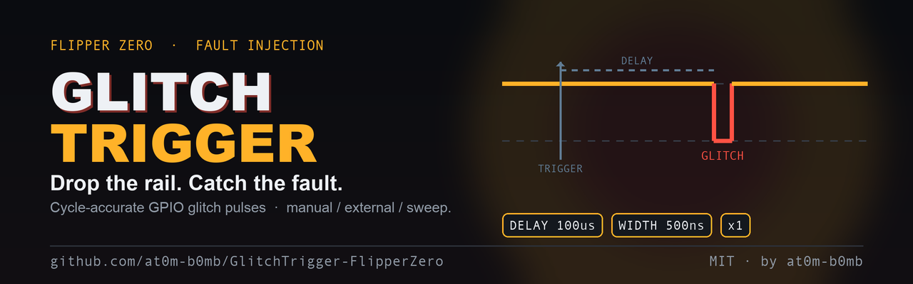
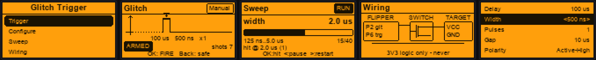
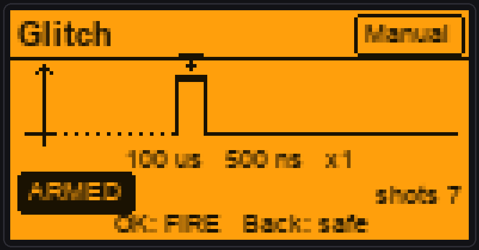

<!-- banner -->
<p align="center">
  
</p>

<h1 align="center">Glitch Trigger</h1>

<p align="center">
  <b>Drop the rail. Catch the fault.</b><br>
  A precise, configurable GPIO pulse generator for voltage-glitch / fault-injection
  study on your own dev boards — for the <a href="https://flipperzero.one">Flipper Zero</a>.
</p>

<p align="center">
  <a href="https://github.com/at0m-b0mb/GlitchTrigger-FlipperZero/actions/workflows/build.yml"></a>
  
  
  
  
</p>

<p align="center">
  
</p>

---

## What it is

**Glitch Trigger** turns your Flipper into a tiny, precise pulse generator for
**hardware fault injection** — the family of attacks where you inject a brief,
carefully-timed disturbance into a chip's power rail (a *voltage glitch*) to make
it skip an instruction, mis-read a fuse, or fall out of a protected state. It's
how people study secure-boot bypasses, PIN-retry counters, and readout
protection on **their own** development boards.

The Flipper can't glitch a target on its own — a 3.3 V GPIO can't crowbar a power
rail. What it *is* good at is producing the **trigger pulse** with tight, jitter-
controlled timing. Glitch Trigger drives a GPIO pin that switches an external
MOSFET / gate-driver crowbar; you dial in the shape of the pulse and how it's
triggered, and the Flipper does the timing.

> **Educational hardware-security tool.** Fault injection can corrupt data and
> permanently damage hardware. Use it only on boards you own and are authorised
> to test. See [Safety & scope](#safety--scope).

---

## Features

- **The shot model** — every trigger produces one *shot*:
  `trigger → delay → pulse(s)`. You set the **delay** (trigger-to-glitch offset),
  the **width** (the glitch itself), the number of **pulses** and the **gap**
  between them, and the **polarity** (active-high or active-low).
- **Cycle-accurate timing** — pulses are shaped by busy-waiting on the Cortex-M4
  **DWT cycle counter** inside a critical section (interrupts masked), so nothing
  else on the MCU can jitter the edge. Resolution ≈ **15.6 ns** (one 64 MHz cycle).
- **Three trigger modes**
  - **Manual** — press **OK** to fire.
  - **External** — an edge on the trigger-in pin fires a shot from a GPIO
    **interrupt**, for lowest latency (arm it to a target's reset/UART/GPIO).
  - **Repeat** — free-running, one shot every interval.
- **Width Sweep** — walk the pulse width across a range (`from … to`, `step`) to
  hunt the fault window. When the target faults, press **OK** to mark the width
  in play.
- **On-device Wiring diagram** — a labelled hook-up sketch (Flipper → MOSFET
  crowbar → target) with rotating safety reminders, so you don't need the README
  on the bench.
- **Live feedback** — an animated pulse timeline, an ARM/FIRE state badge, a shot
  counter, and gated LED / sound / vibro on every shot.
- **Selectable pins** — pick the glitch-out and trigger-in header pins.

---

## Screens

| Menu | Trigger | Sweep | Wiring | Configure |
|---|---|---|---|---|
| Pick a mode | Fire screen with a live pulse timeline | Hunt the fault window | Hook-up + safety | Every parameter |

<p align="center"></p>

The **Trigger** screen is the centrepiece: a schematic timeline shows the trigger
tick, the dashed **delay**, and the glitch **pulse(s)** (drawn up for active-high,
down for active-low). A one-line readout under it echoes the live parameters, and
the badge tracks **IDLE → ARMED → FIRE**.

---

## Safety & scope

Fault injection is genuinely capable of damaging hardware. Read this before you
wire anything.

- **3.3 V logic only.** The Flipper GPIO is a 3.3 V push-pull output. **Never**
  connect a GPIO pin directly to a target power rail or to any voltage outside
  0–3.3 V. The pin *switches* a crowbar; it is not the crowbar.
- **Switch the rail with a MOSFET / gate driver**, not the pin. A logic-level
  N-channel MOSFET (or a dedicated crowbar / glitcher board such as a
  ChipWhisperer target) is the device that actually shorts/drops the rail.
- **Common ground.** The Flipper and the target must share a ground reference.
- **Keep leads short**, add a series gate resistor, and expect to blow up a board
  or two while learning — that's the hobby.
- **Only your own hardware.** Only glitch boards you own and are explicitly
  authorised to test. This tool is for education and defensive research.

---

## Hardware & wiring

```
 Flipper GPIO (3V3)          gate driver / MOSFET             Target board
 ┌───────────────┐          ┌────────────────────┐          ┌───────────┐
 │  pin 2  GLITCH ├──────────┤ gate           drain├──────────┤ VCC / rail│
 │  pin 6  TRIG-IN│◄──edge── │  (logic-level NMOS  │          │           │
 │  pin 8  GND    ├──────────┤  source → GND)      ├──────────┤ GND       │
 └───────────────┘          └────────────────────┘          └───────────┘
                         common ground everywhere
```

**Default pins** (both selectable in *Settings*):

| Signal | Default | Flipper header pin | Notes |
|---|---|---|---|
| Glitch out | `PA7` | **2** | drives the crowbar gate |
| Trigger in | `PB2` | **6** | external-trigger edge input |
| Ground | `GND` | **8 / 11 / 18** | shared with the target |

Selectable output/input pins: `PA7` (2), `PA6` (3), `PA4` (4), `PB3` (5),
`PB2` (6), `PC3` (7). These avoid the SPI / UART / I²C lines so they're safe to
bit-bang.

The in-app **Wiring** screen redraws this with your currently-selected pins.

---

## How the timing works

A shot runs as:

```
FURI_CRITICAL_ENTER();          // interrupts masked → no jitter
  drive idle level
  busy-wait  delay   (DWT cycles)
  repeat pulses:
    drive active
    busy-wait width  (DWT cycles)
    drive idle
    busy-wait gap    (DWT cycles)
FURI_CRITICAL_EXIT();
```

Delays are converted straight to CPU cycles from `SystemCoreClock` (64 MHz) and
timed against `DWT->CYCCNT`, giving **~15.6 ns** granularity. For long arm delays
(> 2 ms) the coarse part runs with interrupts enabled so the system isn't frozen,
and only the final, precision-critical slice is masked. In **External** mode the
shot is fired directly from the GPIO interrupt for the lowest possible
trigger-to-pulse latency.

> The shortest realisable pulse is bounded by the GPIO write + loop overhead
> (tens of ns). Widths below a few hundred ns are approximate — read them as
> "as short as possible", not exact.

---

## Parameters

| Parameter | Range (ladder) | Meaning |
|---|---|---|
| **Delay** | 0 – 100 ms | trigger → first pulse offset |
| **Width** | 62 ns – 500 µs | the glitch pulse width |
| **Pulses** | 1 – 64 | pulses per shot (bursts) |
| **Gap** | 1 µs – 10 ms | spacing between pulses in a burst |
| **Polarity** | Active-High / Active-Low | idle low + pulse high, or idle high + pulse low |
| **Trigger** | Manual / External / Repeat | how a shot is fired |
| **Ext Edge** | Rising / Falling | which edge fires in External mode |
| **Repeat** | 10 ms – 5 s | interval in Repeat mode |
| **Sweep from / to / step** | 62 ns – 500 µs | width range for the sweep hunter |

All values move along 1-2-5 "nice number" ladders, so one knob spans the whole
range and the readout is always in friendly units.

---

## Build & install

Built with **[ufbt](https://pypi.org/project/ufbt/)** against official firmware
(**fw 7 / API 87.1**).

```bash
# one-time
python3 -m pip install --upgrade ufbt
ufbt update            # pull the SDK (release channel)

# in the repo
ufbt                   # build  -> dist/glitch_trigger.fap
ufbt launch            # build + install + run on a connected Flipper
```

Or grab `glitch_trigger.fap` from the [latest release](../../releases) and drop
it into `apps/GPIO/` on your Flipper's SD card.

CI builds every push on both the **release** and **dev** SDK channels.

---

## Project layout

```
glitch_trigger.c / _i.h      app lifecycle, view dispatcher, notifications
application.fam              FAP manifest (category: GPIO)
helpers/
  glitch_config.c/.h         parameter model, value ladders, formatters, pin table
  glitch_engine.c/.h         the pulse engine — DWT timing, GPIO, external-trigger ISR
views/
  trigger_view.c/.h          the fire screen (pulse timeline + state machine)
  sweep_view.c/.h            the width-sweep hunter
  wiring_view.c/.h           the hook-up diagram + safety tips
scenes/                      start · params · trigger · sweep · wiring · settings · about
icons/  images/              app icon, banner, social card, screen mockups
tools_gen_*.py               regenerate the icon / banner / mockups
```

---

## Ethics & legal

This is an **educational hardware-security** project. Fault injection is a
legitimate and widely-taught technique for understanding — and defending against
— attacks on embedded devices. Use Glitch Trigger only on hardware you own or are
explicitly authorised to test. You are responsible for what you connect it to.

---

## License

[MIT](LICENSE) © 2026 [at0m-b0mb](https://github.com/at0m-b0mb)

<p align="center"><sub>Part of the at0m-b0mb Flipper Zero toolset · built with ufbt</sub></p>
